# BlogApp

Medium-clone blogging application built using Flutter.

## Features

- User authentication
- Blog list
- Read Blogs
- Search topics to read
- Follow other bloggers according to your interest


## SDK Versions

Dart SDK Version 2.12.0 or greater.

Flutter SDK Version 2.0.0 or greater.

## Libraries

1. [cupertino_icons](https://pub.dev/packages/cupertino_icons) - for iOS icons
2. [connectivity](https://pub.dev/packages/connectivity) - For status of network connectivity
3. [get](https://pub.dev/packages/get) - State management
4. [fluttertoast](https://pub.dev/packages/fluttertoast) - Toast Library for Flutter


## App Navigation

Check your app's UI from the AppNavigation screen of your app.

## Package Structure

Project follows [GetX](https://pub.dev/packages/get) State-management.

```
.
├── main.dart                   - starting point of the application
├── core
│   ├── app_export.dart         - contains commonly used file imports 
│   ├── errors                  - contains error handling classes                  
│   ├── network                 - contains network related classes
│   ├── widgets                 - contains comman UI widgets
│   └── utils                   - contains common files and utilities of project
├── data
│   ├── apiClient               - contains api calling methods
│   ├── dataSources             -     
│   ├── models                  - contains request/response models 
│   └── repository              - network repository
├── localization                - contains localization classes
├── presentation               
│   └── screens                 - contains all screens
├── routes                      - contains all the routes of application
└── theme                       - contains app theme and decoration classes
```

## Detailed Files and Folder Structure

Project structure is divided into 5 folders.

**1. core**

- This folder contains files related to network connectivity, error handling classes, utility classes, common widget classes and common files are exported here.

**2. data**

- This folder contains api_client.dart file and screen specific API request/response model. There will be folders for each screen(when APIs are integrated in that screen).

- api_client.dart - this file contains code for API calls.

**3. localization**

- This folder contains app_localization.dart and language specific folders.

- app_localization.dart - it calls all language translation classes.

**4. presentation**

- Structure of presentation is as follows:
```
                .
                ├── presentation               
                .   └── app_navigation_screen         
                ├── bindings    
                │   └── app_navigation_binding.dart
                ├── controller
                │   └── app_navigation_controller.dart
                ├── models
                │   └── app_navigation_model.dart
                └── app_navigation_screen.dart
```   
- Here, there's a folder for every screen, which contains that files for bindings, controller, data-models and screen.

**5. routes**

- Routes contains navigation routes for all screen as well as it injects bindings and screen classes.

**6. theme**

- Theme contains code for text-styles, various decorations for borders and containers, are defined here.

## Demo Application -  [Blog_App](https://github.com/DhiWise/BlogApp-Flutter/raw/master/blog.apk) 

## Application screenshots


| Sign Up Screen      | Sign In Screen      | Home Screen      |
|------------|-------------|-------------|
|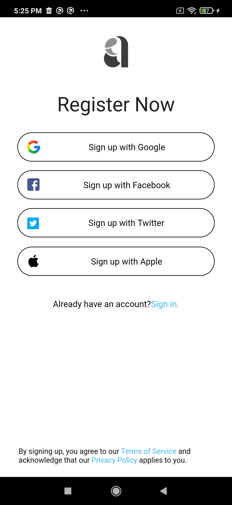 | 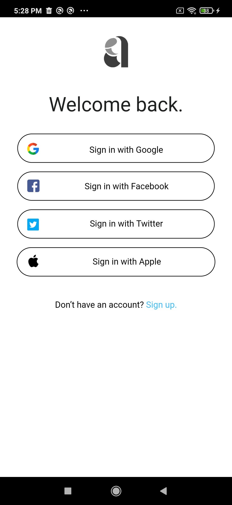 | 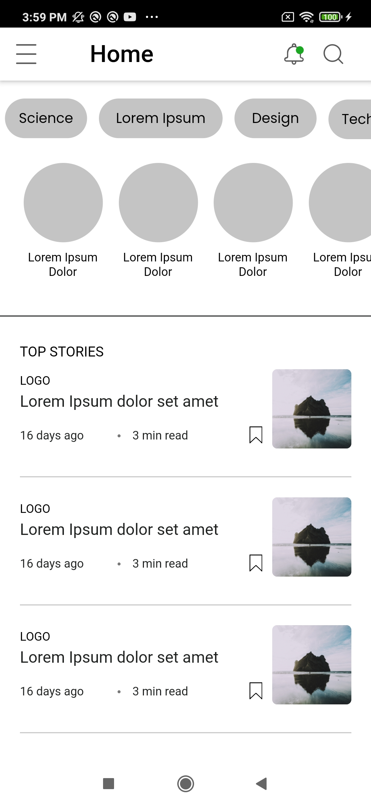 |
| Blog Screen      | Drawer Menu      | Explore Screen      |
|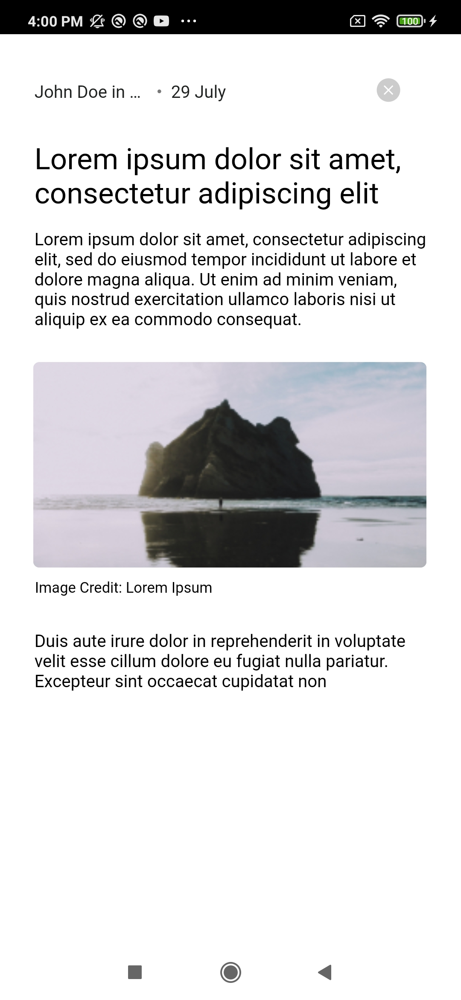 | 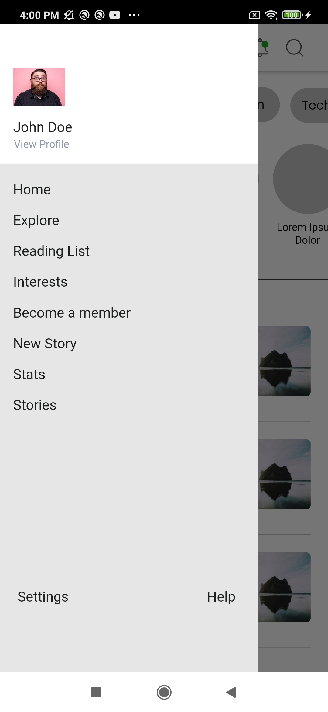 | 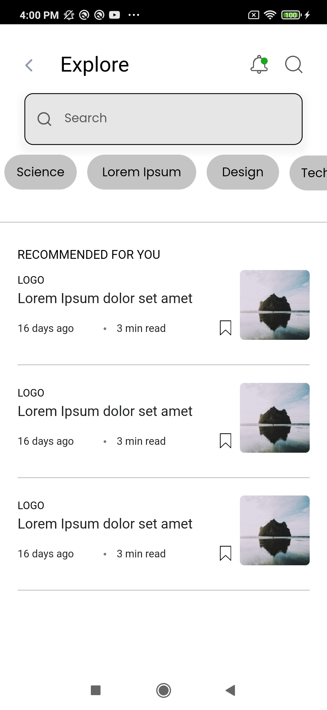 |
| Notification Screen     | Interest People Screen      | Interest Publication Screen      |
|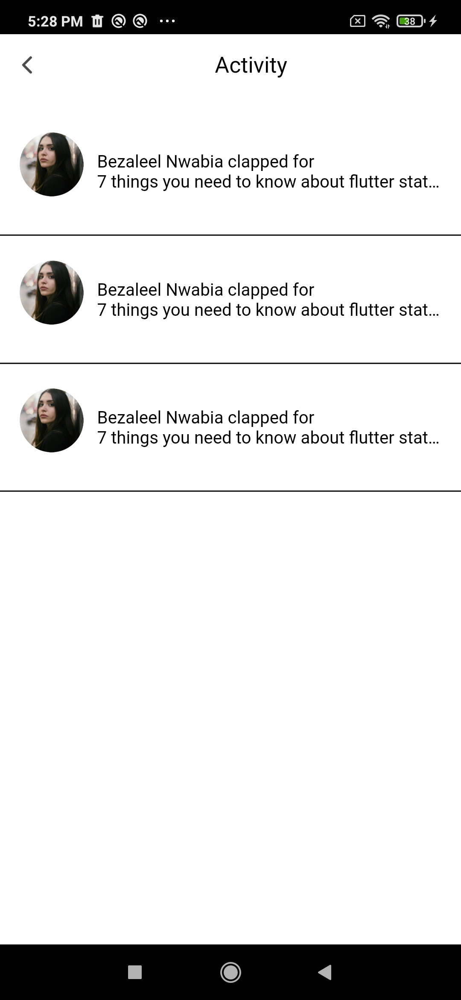 | 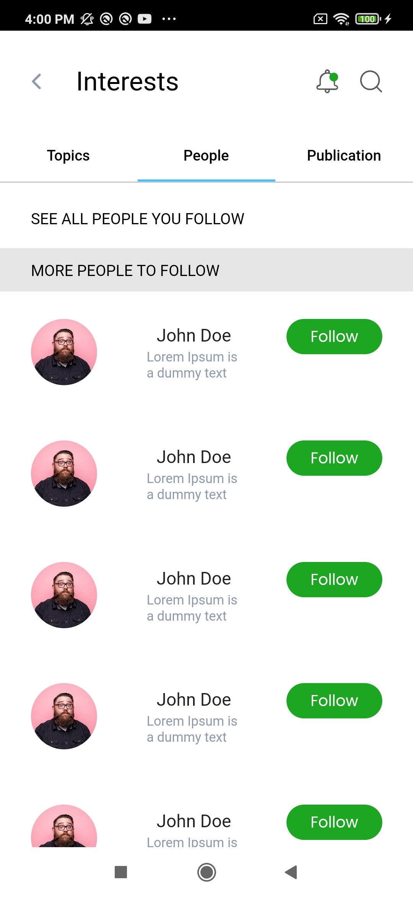 | 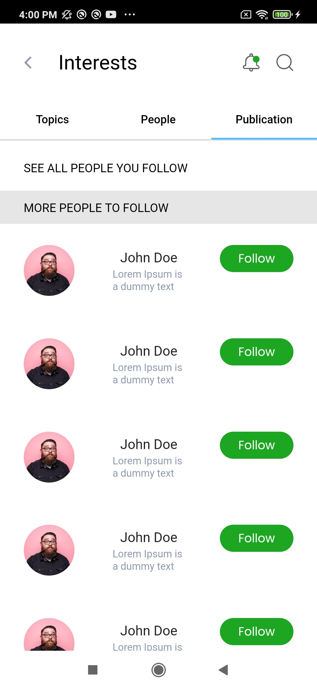 |
| Interest Topics Screen      | Interest Screen      | Search Screen      |
|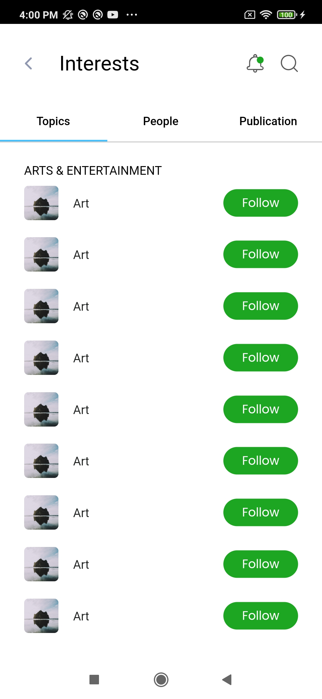 | 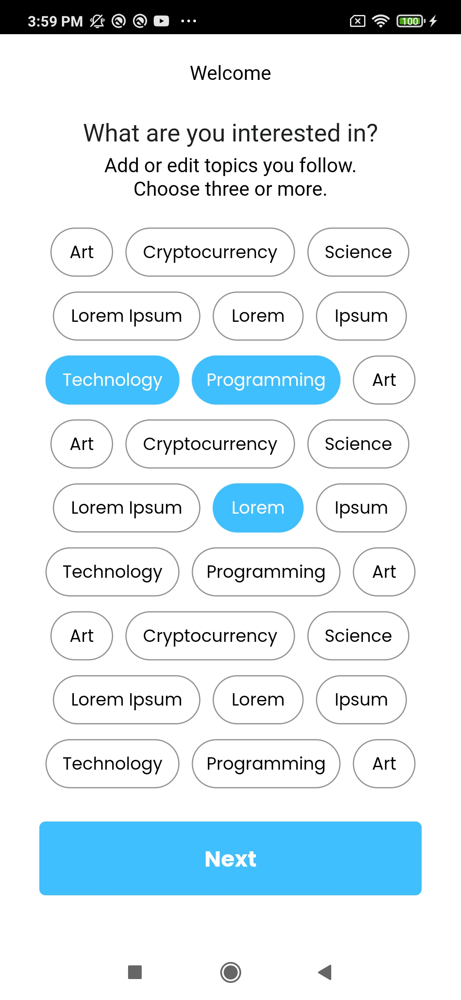 | 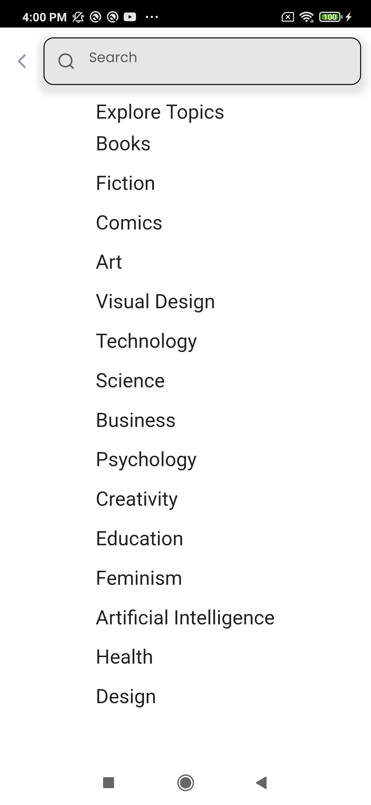 |
| Privacy Screen    | Terms and Condtions Screen     |
|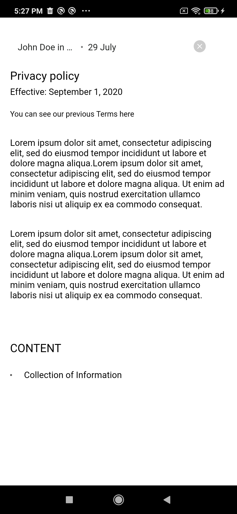 | 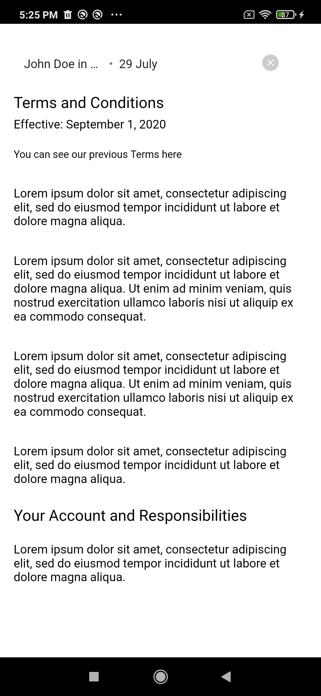 |


