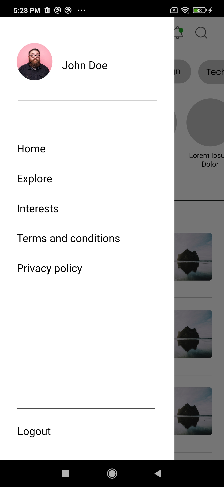

This repository contains Flutter app code generated from [the DhiWise platform](https://app.dhiwise.com/sign-up). The app code showcases all the awesome features DhiWise provides; its functionality, and the speed at which developers can create apps on the DhiWise platform.

# How was the code generated?

Flutter developers only need the app design (Figma, XD, or Sketch) or pick a design template from the DhiWise template library, to start creating their app.

The Flutter app builder with identify all the design components and generate respective code for the view components within seconds. Additionally, we provide features to change view component type and to create actions for view components.

Once the configuration is completed, Developers can download the source code or sync it to GitHub or GitLab.


# BlogApp

A new Flutter project.

## SDK Versions

Dart SDK Version 2.12.0 or greater.

Flutter SDK Version 2.0.0 or greater.

## Libraries

1. [cupertino_icons](https://pub.dev/packages/cupertino_icons) - for iOS icons
2. [connectivity](https://pub.dev/packages/connectivity) - For status of network connectivity
3. [get](https://pub.dev/packages/get) - State management
4. [fluttertoast](https://pub.dev/packages/fluttertoast) - Toast Library for Flutter


## App Navigation

Check your app's UI from the AppNavigation screen of your app.

## Package Structure

Project follows [GetX](https://pub.dev/packages/get) State-management.

```
.
├── main.dart                   - starting point of the application
├── core
│   ├── app_export.dart         - contains commonly used file imports 
│   ├── errors                  - contains error handling classes                  
│   ├── network                 - contains network related classes
│   ├── widgets                 - contains comman UI widgets
│   └── utils                   - contains common files and utilities of project
├── data
│   ├── apiClient               - contains api calling methods
│   ├── dataSources             -     
│   ├── models                  - contains request/response models 
│   └── repository              - network repository
├── localization                - contains localization classes
├── presentation               
│   └── screens                 - contains all screens
├── routes                      - contains all the routes of application
└── theme                       - contains app theme and decoration classes
```

## Detailed Files and Folder Structure

Project structure is divided into 5 folders.

**1. core**

- This folder contains files related to network connectivity, error handling classes, utility classes, common widget classes and common files are exported here.

**2. data**

- This folder contains api_client.dart file and screen specific API request/response model. There will be folders for each screen(when APIs are integrated in that screen).

- api_client.dart - this file contains code for API calls.

**3. localization**

- This folder contains app_localization.dart and language specific folders.

- app_localization.dart - it calls all language translation classes.

**4. presentation**

- Structure of presentation is as follows:
```
                .
                ├── presentation               
                .   └── app_navigation_screen         
                ├── bindings    
                │   └── app_navigation_binding.dart
                ├── controller
                │   └── app_navigation_controller.dart
                ├── models
                │   └── app_navigation_model.dart
                └── app_navigation_screen.dart
```   
- Here, there's a folder for every screen, which contains that files for bindings, controller, data-models and screen.

**5. routes**

- Routes contains navigation routes for all screen as well as it injects bindings and screen classes.

**6. theme**

- Theme contains code for text-styles, various decorations for borders and containers, are defined here.

#Application screenshots


    


